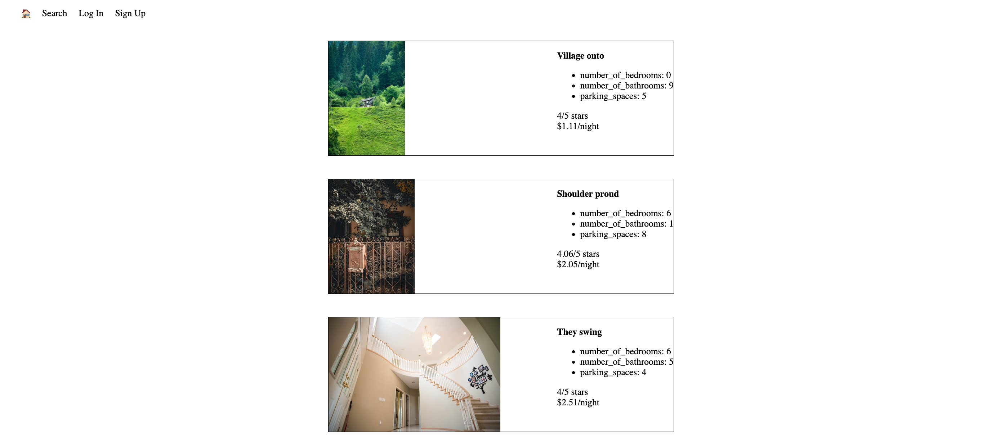
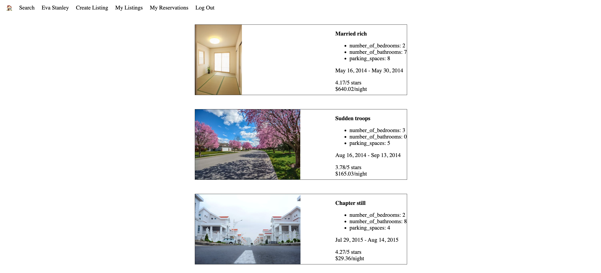
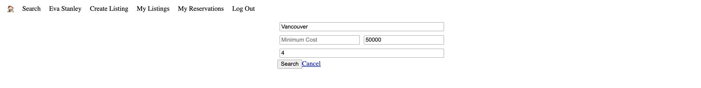
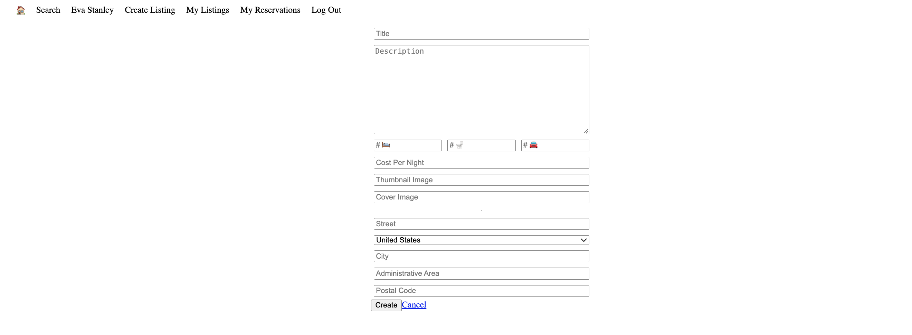
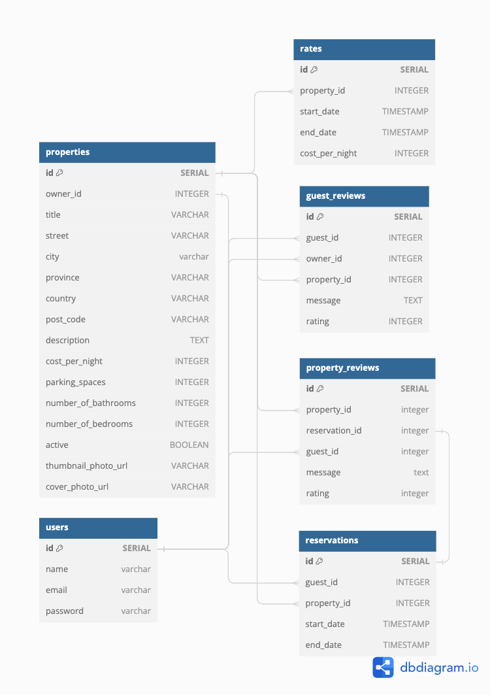

# LightBnB
LightBnB is a AirBnB clone that allows users to create an account, log into their account, list properties, search properties, display user properties and display user reservations. The main front-end web app was provided by Lighthouse Labs.

## Features
- Users: a user can create an account and log into an already created account.
- Create Listing: a user once logged in can create a property listing by competing the form.
- My Listings: a user once logged in can view the users listings.
  - Note: only properties with a rating will be queried. Newly created listings will not have a rating and will not appear.
- My Reservations: a user once logged in can view their property reservations.
  - Note: users cannot create reservations. Newly created users will not have any reservations listed.
- Search: a user can search for a property using city, minimum cost, maximum cost, or minimum rating.

## Screenshots
### Home Page


### Reservation's Page


### Search Page


### Create Listing Page


### Database ERD


## Using this App

### Home Page
This page displays 10 properties and their information

### Login
Use this page to login as any user in the database. a user login is provided in the [set up](#set-up) section, or you can login as a user you create on the sign up page, or any user you find in the seed data.

### Sign Up
Use this page to create a user account. New users will not have any reservations.

### Search
When logged in you can use the search function. You can search for properties by city, minimum cost, maximum cost, minimum rating, or any combination of the filters. **IMPORTANT** Minimum and Maximum cost is in cents $1 = 100, $100 = 1000 so keep this in mind when using cost to search!

### Create Listing
When logged in a user can create a listing by filling out the form of the listings information. *Reminder new listings will not have a rating and will not be queried on the home page or my listings*

### My listings
When logged in this page will display the users listings. This will only work for seed created users as mentioned in create listing, new listings will not be displayed here.

### My Reservations
When logged in a user can view their reservations. New users cannot create reservations and this page will be blank.

### Log Out
Logs out the current user

## Set Up
Follow these steps to install and set up this project. Note: these instructions assume you already have PostgreSQL installed. If you do not please install it from [PostgreSQL](https://www.postgresql.org/download/).
1. Clone the Repository & cd into repository
```
git clone git@github.com:Carmichaeldb/LightBnB.git && cd lightBnB
```
2. Enter PostgreSQL in Terminal and Create a database
```
psql
CREATE DATABASE lightBnB;
```
3. Connect to Database
```
\c lightBnB
```
4. Create Tables and Seed Data
```
\i migrations/01_schema.sql
\i seeds/01_seeds.sql
\i seeds/02_seeds.sql
```
5. Set Up Web App: CD into LightBnB_WebApp and run npm install *note: exit postgres with \q or use a new terminal tab in the root lightBnB folder*
```
cd LightBnB_WebApp
npm install
```
6. Connect to Server
```
npm run local
```
7. Open your browser and navigate to [localhost:3000].(http://localhost:3000/)
8. Login as user Eva Stanley or Create a new user *reminder: new users will not have reservations*
```
User Eva Stanley
login email: sebastianguerra@ymail.com
password: password
```
9. Enjoy!

## Additional Queries
Inside the folder 1_queries is contained 5 SQL query files. These were written for education and can be run in PostgreSQL by doing the following from the root lightBnB folder:
```
cd 1_queries
psql
```
Then you may run any of the following queries
Average Reservation Duration;
```
\i average_reservation_duration.sql;
```
Property List By City - Vancouver
```
\i list_by_city.sql;
```
Most Visited Cities
```
\i most_visited_cities.sql;
```
User Login Information - Devin Sanders
```
\i user_login.sql;
```
All User Reservations - Devin Sanders
```
\i user_reservations.sql;
```

## Additional Comments
This app was created by Lighthouse Labs for the purpose of education. The student David Carmichael built the ERD, 01_schema, 01_seeds, all queries within 1_queries, and within the lighthouseBnB_WebApp DB folder both database.js and index.js.